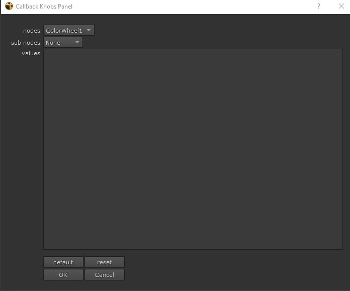
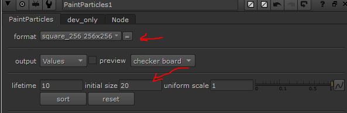
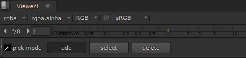
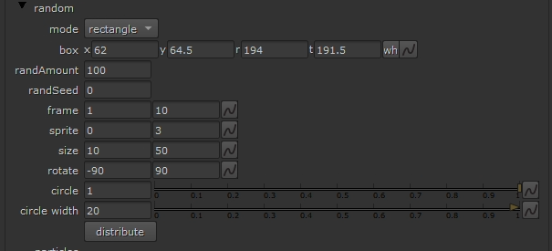
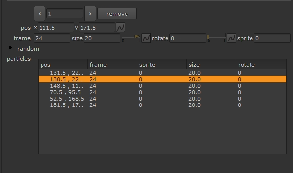
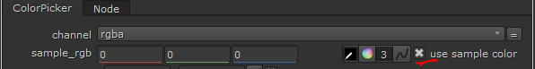
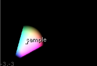
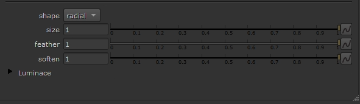
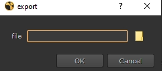

# Samples

## python

### callbackKnobs

**description**
A helper panel to quickly add commands to the knobChanged or onCreate knob of a node.

**installation**
Add th callbaclKnobs.py to your .nuke folder and add the following lines to your menu.py:

                nukeMenu=nuke.menu("Nuke")
                nukeMenu.addCommand("callbackKnobs/knobChanged", "callbackKnobs.callbackKnobsByUI('knobChanged')")
                nukeMenu.addCommand("callbackKnobs/onCreate", "callbackKnobs.callbackKnobsByUI('onCreate')")

**usage**
Select the node you want. Select wich callback knob you want to access, knobChanged or onCreate, and select the callbackKnobs function acordingly.
A panel pops up. Now add the python code into the values knob. The default button sets up a default function setting thisNode and thisKnob varriables. The reset button resets the values knobs. The sub nodes pulldown choice lets you select nodes from inside your current selected node.

### my3d.py

**description**
A small selection of helper functions working in 3d and with 3d geo in Nuke.

**animAxisFromVertex:**
select a vertex with animation and run. The resulting axis will follow the vertex.

**animAxisFromAlembicTransform:**
Select a ReadGeo with alembic cache file and run. Returns an Axis for each geo and animates it local_matrix with the alembic cache geo.

**axisFromAxis:**
Select one or more Axises and run. Selec a method in the panel and result will be an Axis based on the selection made. Works basically like the snap_menu, but with Axis than Vertexes.

**inverseAxis:**
Select an Axis and run. The result is the inverted Axis. Inverses the world_matrix!

## gizmos

### PaintParticles

**description**
Let's the user "paint" Particles in the viewer.

**installation**
Unpack both paintParticles.py and PaintParticles.gizmo into the .nuke folder and insert the following lines into the menu.py
        
        import paintParticles
        nuke.menu("Nodes").addCommand("PaintParticles/PaintParticles", nuke.nodes.PaintParticles)

**usage**
First, set the format, lifetime and intial size for your particles.

Now, select the Add mode and the picker form the viewer toolbar.

Add points by holding down alt and right clicking into the viewer, the current frame will be start frame.
You can also select and delete points by changing the selection mode to either select or delete in the viewer toolbar and then alt click on the point. 

Alternative you can create points by randomly creating distributing them.
Open the random group and change the distribution box to the size you want your particles be distributed in. Choose the distribution mode, rectangle, in circle and on circle.Change the rest of the random attributes and hit the distribute button.

You can change all attributes of a particle, by first selecting one, either in the viewer (see above), or from the selection panel.

### ColorPicker

**description**
Key color in Yxy colorspace.

**installation**
Add ColorPicker.gizmo to the .nuke folder and the following line into the menu.py
        
        nuke.menu("Nodes").addCommand("ColorPicker/ColorPicker", nuke.nodes.ColorPicker)

**usage**
Pick a color with the color picker and the "use sample color" knob checked.

Alternatively, uncheck the "use sample color" knob and pick a color from the Yxy sampler in the bottom left of the viewer.

Change the attributes to match the key the you want.

## TCL

### exportScript

**description**
A tcl script that outsmarts Nukes Non-Commercial, only export binary files.

**installation**
Add the exportScript.tcl file into your.nuke folder and add the following line into your menu.py

                nuke.menu("Nuke").addCommand("exportScript/exportScript", "nuke.tcl('load exportScript; exportScript')")

**usage**
Run the script with a nuke script open. A small panel asks you to choose a file to save to. Hit OK. And done

**notice:** This is not for procduction scenarios, but for hobby blogger, wantig to share some script love.

